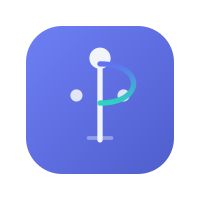

# PosturePilot

> Your calm posture co-pilot during long computer sessions.

<p align="center">
  
</p>

<p align="center">
  
  
  
  
  
  
  
</p>

> **Disclaimer:** PosturePilot is not a medical device and does not provide clinical advice.
> It is designed for posture awareness and habit-building only. If you experience pain or
> health concerns, consult a qualified healthcare professional.

---

## Overview

PosturePilot is a browser-based posture awareness assistant built for people who spend long
hours at a computer. It uses the device webcam and
[MediaPipe PoseLandmarker](https://developers.google.com/mediapipe/solutions/vision/pose_landmarker)
to detect body landmarks in real time, then maps those landmarks through an explicit gesture
dictionary to produce posture conditions — shoulder imbalance, trunk lean, head misalignment,
and others — and gives gentle, non-judgmental feedback while you work.

The app runs entirely in the browser. No account is needed. No video or posture data leaves
your device. Everything — session history, calibration baseline, user profile — lives in
`localStorage` and can be cleared at any time from Settings.

This project was developed as an academic prototype at the University of Salamanca, in the
context of gesture-based interaction, AI-assisted posture awareness, and human-computer
interaction research. The UX is evaluated against Nielsen's usability heuristics, recorded
in `src/data/heuristicEvaluation.ts` and documented in `docs/report/`. The result sits
between a research prototype and a production-quality web app: real MediaPipe inference,
real browser APIs, a structured test suite, and a complete user experience — without a
clinical validation layer.

---

## Why PosturePilot?

People who work or study at a computer for long periods tend to drift into uncomfortable
positions without noticing. The shift is gradual — a slight forward lean, one shoulder
rising, the head moving off-center — and by the time discomfort registers, the session is
already several hours in.

Most posture tools respond to this with either a wearable (which requires hardware) or a
generic stretch timer (which ignores what the user's body is actually doing).
PosturePilot takes a different approach: it uses the webcam already present in most laptops
to observe posture in real time and surface condition-specific feedback tied to an explicit,
readable rule set. Every feedback message can be traced directly to specific body landmarks
and a threshold defined in `src/data/gestureDictionary.ts`. Nothing is a black box.

The secondary goal is habit formation. A single correction is not useful if the user returns
to the same position five minutes later. PosturePilot addresses this with a global reminder
system, per-session history, and a weekly habit tracker that makes patterns visible over
multiple sessions.

---

## Who It Is For

PosturePilot is designed for anyone who regularly spends 4+ hours per day at a computer:

- **Remote workers** — long desk sessions at home without ergonomic support
- **Students** — study sessions and exam periods with high screen time
- **Researchers** — reading and writing-heavy work at desks or laptops
- **Developers and programmers** — extended coding sessions in fixed positions
- **Office workers** — standard desk environments without real-time posture monitoring

The app is not designed for clinical use, physiotherapy, or medical assessment.

---

## Features

### Real-time posture awareness
- Live webcam pose detection via MediaPipe PoseLandmarker (Lite, float16)
- Skeleton overlay drawn on an HTML5 Canvas, synchronized with the video frame via
  `requestAnimationFrame`
- Five explicit posture conditions with human-readable feedback
- Soft visual posture overlay — ambient border feedback, not aggressive alerts
- Low visibility detection when body landmarks fall below the confidence threshold
- Confidence score shown alongside posture status

### Smoothing and stabilization
- **Landmark EMA smoother** (`LandmarkSmoother`): applies exponential moving average to
  x, y, z, and visibility of each MediaPipe landmark. Three configurable levels — Low
  (α=0.55), Balanced (α=0.35, default), High (α=0.20)
- **Scalar EMA smoother** (`ScalarSmoother`): applied to individual display metrics
  (shoulderTilt, trunkAngle, neckOffset at α=0.15; confidence at α=0.20)
- **Status stabilizer** (`statusStabilizer.ts`): hysteresis filter requiring 3 consecutive
  `bad` frames, 5 `warning` frames, or 7 `good` frames before the status badge changes

### Personalization
- Optional profile setup: role, daily screen hours, remote work status, posture goal
- Profiles: Remote Worker, Student, Researcher, Developer/Programmer, Office Worker, Custom
- Role-adapted reminder checklist items and intervals
- All profile data stored locally — no account or registration

### Calibration
- Personal posture baseline captured during a 3-second countdown
- Requires ≥10 frames at average confidence ≥0.55 to be valid
- Preview step shows averaged baseline values before committing — Accept or Try again
- Live deviation from baseline shown during active sessions
- Baseline can be reset from the calibration panel or from Settings
- Saved baseline: `{ shoulderTilt, trunkAngle, neckOffset, createdAt }`

### Session control
- Session states: `idle | running | paused | stopped`
- Switching away from the Live Check tab auto-pauses the session
- On return, the user sees the session paused screen and can Resume or End
- Session elapsed time tracked via `performance.now()` refs inside the always-mounted
  `PoseCamera` component — no Web Worker required

### Analytics and habits
- Per-session summary: good / warning / bad distribution, most frequent condition
- Session records include role at time of session (`profileRole?: string`)
- Session history persisted locally with a soft cap of 60 records
- Weekly habit grid and condition frequency chart (Recharts)
- Personalized recommendations based on condition history and profile

### Reminders
- Global reminder timer (`useReminderTimer`) persists across tab switches
- Pause and resume controls
- Role-adapted checklist items
- Browser notifications via Web Notifications API — permission requested only after an
  explicit user action, never on page load
- Anti-fatigue design: varied reminders, reasonable intervals

### Privacy and local-first design
- No account, no server, no data upload of any kind
- All posture inference runs locally in the browser
- MediaPipe model (~3 MB) and WASM runtime (~5 MB) are downloaded from CDN on first use
  and cached by the browser; no user data is ever sent outbound
- All saved data (profile, history, calibration) stored in `localStorage`
- **Clear all saved data** in Settings removes everything completely

---

## Tech Stack

| Layer | Technology |
|---|---|
| UI framework | React 18 |
| Language | TypeScript 5 |
| Build tool | Vite 5 |
| Pose detection | MediaPipe PoseLandmarker (Lite, float16) |
| Rendering | HTML5 Canvas + CSS |
| Webcam access | `getUserMedia` (MediaDevices API) |
| Animation loop | `requestAnimationFrame` |
| Charts | Recharts |
| Local persistence | `localStorage` (max 60 session records) |
| Browser notifications | Web Notifications API |
| Testing | Vitest + React Testing Library |

---

## How It Works

The posture awareness pipeline runs as follows:

```
User opens app
  └─ Welcome screen checks localStorage for saved setup
       ├─ Resume with saved profile
       ├─ Create new profile (optional onboarding)
       └─ Continue without setup

User starts Live Check
  └─ Browser requests camera permission (getUserMedia)
       └─ Webcam video stream begins

Each animation frame (requestAnimationFrame):
  └─ MediaPipe PoseLandmarker runs inference on the video frame
       └─ Raw NormalizedLandmarkList returned
            └─ LandmarkSmoother applies EMA (α configurable per smoothing level)
                 └─ postureMath.ts calculates PostureResult:
                      ├─ shoulderTilt   (ratio, threshold 0.06)
                      ├─ trunkAngle     (degrees, threshold 15°)
                      ├─ neckOffset     (ratio, threshold 0.10)
                      ├─ confidence     (avg visibility of key landmarks)
                      └─ activeConditions  (list from gestureDictionary)
                           └─ ScalarSmoother applied to display values
                                └─ statusStabilizer applies hysteresis
                                     ├─ drawSkeleton renders points + connections on canvas
                                     ├─ PostureReport shows condition badge + feedback
                                     └─ PostureOverlay applies soft ambient border

Globally (across all tabs):
  └─ useReminderTimer runs reminder interval
       └─ Checklist items triggered, browser notification dispatched (if permitted)

User actions at any time:
  ├─ Calibrate → 3-second countdown → preview → Accept or Try again
  ├─ Pause session → session state = 'paused'
  └─ End session → PostureResult summary computed → saved to history → Analytics updated

Analytics tab:
  └─ Reads up to 60 session records from localStorage
       └─ Renders stat cards, distribution chart, habit grid, recommendations
```

Body posture is the primary input modality. There are no buttons, sliders, or traditional
gestures during tracking — the body itself is the signal. This places PosturePilot in the
area of **passive gesture recognition** and **natural user interfaces**.

---

## Architecture

### Repository structure

```
posture-pilot/
├── public/                        # Static assets served at root
│   ├── favicon.png                # 32×32 browser favicon
│   ├── favicon-16.png             # 16×16 small favicon
│   ├── favicon-64.png             # 64×64 hi-res favicon
│   ├── favicon.svg                # SVG favicon (modern browsers)
│   ├── logo-mark.svg              # Primary PosturePilot mark
│   ├── og-image.png               # 1200×630 Open Graph / social preview image
│   ├── manifest.json              # PWA manifest (display: standalone, icons)
│   ├── posturepilot-app-icon-192.png
│   └── posturepilot-app-icon-512.png
│
├── src/
│   ├── app/                       # App.tsx — top-level state and layout shell
│   ├── assets/                    # Logo variants, brand illustrations
│   ├── components/                # All React UI components
│   ├── data/                      # Static data: gesture dictionary, heuristic evaluation
│   ├── hooks/                     # Custom React hooks (useReminderTimer, etc.)
│   ├── lib/
│   │   ├── calibration/           # Baseline creation, deviation calculation, reset
│   │   ├── evaluation/            # heuristicMetrics.ts — before/after score helpers
│   │   ├── history/               # Session history persistence (max 60 records)
│   │   ├── notifications/         # Web Notifications API wrapper
│   │   ├── pose/                  # postureMath, drawSkeleton, smoothing, statusStabilizer
│   │   ├── recommendations/       # Condition-based recommendation logic
│   │   └── reminders/             # Reminder templates and scheduling
│   ├── styles/                    # Global CSS / design tokens
│   ├── test/                      # Test utilities, mocks, shared fixtures
│   └── types/                     # Shared TypeScript interfaces
│                                  # (posture.ts, session.ts, calibration.ts, …)
│
├── docs/
│   ├── report/
│   │   ├── implementation-summary.md
│   │   └── heuristic-evaluation-es.md   # Spanish academic heuristic evaluation
│   ├── screenshots/               # App screenshots (added after final QA)
│   └── testing/
│       └── testing-guide.md
│
├── README.md
├── LICENSE
├── .gitignore
├── package.json
├── vite.config.ts
├── tsconfig.json
└── tsconfig.node.json
```

### Architecture overview

```
┌─────────────────────────────────────────────────────────────┐
│                          Browser                            │
│                                                             │
│  ┌───────────────────────────────────────────────────────┐  │
│  │  App.tsx  (useState — no Context, no Zustand)         │  │
│  │  profile · baseline · sessionSummary · history        │  │
│  │  activeTab · smoothingLevel · sessionCheckpoint        │  │
│  │                                                       │  │
│  │  ┌───────────────┐  ┌──────────────────────────────┐  │  │
│  │  │ WelcomeScreen │  │      Live Check tab           │  │  │
│  │  │ (onboarding)  │  │  ┌────────────────────────┐  │  │  │
│  │  └───────────────┘  │  │     PoseCamera          │  │  │  │
│  │                     │  │  getUserMedia            │  │  │  │
│  │  ┌───────────────┐  │  │  rAF loop               │  │  │  │
│  │  │ ReminderPanel │  │  │  MediaPipe inference     │  │  │  │
│  │  │ useReminder   │  │  │  LandmarkSmoother (EMA)  │  │  │  │
│  │  │   Timer       │  │  └──────────┬─────────────┘  │  │  │
│  │  └───────────────┘  │             │                 │  │  │
│  │                     │  ┌──────────▼─────────────┐  │  │  │
│  │  ┌───────────────┐  │  │   postureMath.ts        │  │  │  │
│  │  │  Analytics    │  │  │   PostureResult         │  │  │  │
│  │  │  Dashboard    │  │  │   ScalarSmoother        │  │  │  │
│  │  └───────────────┘  │  └──────────┬─────────────┘  │  │  │
│  │                     │             │                 │  │  │
│  │  ┌───────────────┐  │  ┌──────────▼─────────────┐  │  │  │
│  │  │  Calibration  │  │  │  gestureDictionary      │  │  │  │
│  │  │  Panel        │  │  │  → PostureCondition[]   │  │  │  │
│  │  └───────────────┘  │  └──────────┬─────────────┘  │  │  │
│  │                     │             │                 │  │  │
│  │  ┌───────────────┐  │  ┌──────────▼─────────────┐  │  │  │
│  │  │   Settings    │  │  │  statusStabilizer       │  │  │  │
│  │  └───────────────┘  │  │  (hysteresis filter)    │  │  │  │
│  │                     │  └──────────┬─────────────┘  │  │  │
│  │                     │             │                 │  │  │
│  │                     │  ┌──────────▼─────────────┐  │  │  │
│  │                     │  │ drawSkeleton + Report   │  │  │  │
│  │                     │  │ + PostureOverlay        │  │  │  │
│  │                     │  └────────────────────────┘  │  │  │
│  │                     └──────────────────────────────┘  │  │
│  └───────────────────────────────────────────────────────┘  │
│                                                             │
│  ┌─────────────────────────────────────────────────────┐    │
│  │  localStorage                                       │    │
│  │  profile · calibration · sessions (max 60) · prefs │    │
│  └─────────────────────────────────────────────────────┘    │
└─────────────────────────────────────────────────────────────┘
        │                              │
  pose_landmarker_lite.task      @mediapipe/tasks-vision WASM
  storage.googleapis.com         cdn.jsdelivr.net
  (~3 MB, cached after first load)
```

---

## Key Files and Responsibilities

### `src/app/App.tsx`
Top-level state container and layout shell. All critical state lives here in `useState`
and is passed down as props — no Context, no Zustand. Manages: active tab, user profile,
posture baseline, session summary, session history, smoothing level, and session checkpoint.
Also calls `useReminderTimer(userProfile)` and owns the `buildSessionRecord()` helper that
assembles history entries when a session ends.

### `src/components/PoseCamera.tsx`
The core camera and inference component. Opens the webcam via `getUserMedia`, runs the
`requestAnimationFrame` loop, feeds each video frame to MediaPipe PoseLandmarker, applies
`LandmarkSmoother`, and passes the results to `postureMath`. Calls the `onPostureUpdate`
callback each frame. Manages its own `CameraState`:
`initializing | ready | requesting-camera | running | paused | stopped | error`.
The component is always mounted in the DOM (hidden with `display: none` when the tab is
inactive) so the session timer survives tab switches.

### `src/lib/pose/postureMath.ts`
Pure function module. Accepts a smoothed `NormalizedLandmarkList` from MediaPipe and
returns a `PostureResult` (see `src/types/posture.ts`):

```typescript
interface PostureResult {
  status: 'good' | 'warning' | 'bad'
  shoulderTilt: number        // ratio, threshold 0.06
  trunkAngle: number          // degrees, threshold 15°
  neckOffset: number          // ratio, threshold 0.10
  confidence: number          // 0–1, avg visibility of key landmarks
  activeConditions: PostureCondition[]
}
```

### `src/lib/pose/smoothing.ts`
Two classes:
- `LandmarkSmoother` — EMA on x, y, z, visibility per landmark. α: Low=0.55,
  Balanced=0.35 (default), High=0.20
- `ScalarSmoother` — EMA on single numeric values. Used for display metrics at α=0.15
  (shoulderTilt, trunkAngle, neckOffset) and α=0.20 (confidence)

### `src/lib/pose/statusStabilizer.ts`
Hysteresis filter. Prevents rapid status badge flicker by requiring consecutive frames
before a status transition is committed: `bad` needs 3 frames, `warning` needs 5,
`good` needs 7.

### `src/lib/pose/drawSkeleton.ts`
Canvas rendering module. Signature:
`drawSkeleton(ctx, landmarks, status, width, height, confidence)`.
Draws landmark dots and connecting lines. Called from `PoseCamera` — not inlined.

### `src/data/gestureDictionary.ts`
The explainability layer. Each posture condition is a named record specifying: condition ID,
key landmark indices, metric thresholds that trigger it, user-facing feedback string, and
severity level. Makes every posture judgment fully traceable — from feedback text back to
specific body landmarks and specific threshold values.

### `src/data/heuristicEvaluation.ts`
Static data containing before/after scores for all 10 Nielsen heuristics. Calculation
helpers (`calculateAverageBefore`, etc.) live in `src/lib/evaluation/heuristicMetrics.ts`.
Source for the academic report in `docs/report/heuristic-evaluation-es.md`.

### `src/hooks/useReminderTimer.ts`
Custom hook managing the global reminder interval. Accepts `userProfile` and adapts
checklist items and intervals per role. Survives tab switches because it is mounted in
`App.tsx` (top-level), not inside the Reminders tab component. Exposes `pause`, `resume`,
and next-reminder countdown.

### `src/lib/calibration/calibrationLogic.ts`
Handles baseline creation from a multi-frame capture (requires ≥10 samples, average
confidence ≥0.55), deviation calculation between live `PostureResult` and saved baseline,
and reset. Baseline type: `{ shoulderTilt, trunkAngle, neckOffset, createdAt }`.

### `src/lib/history/sessionHistoryStorage.ts`
`localStorage` adapter for session records. Enforces a soft cap of 60 records
(`MAX_RECORDS = 60`). The `writeHistory` call is wrapped in `try/catch` — if the browser
throws a quota error it silently skips (no user-facing message).

### `src/lib/notifications/notificationService.ts`
Thin wrapper around the Web Notifications API. Checks permission state before dispatching.
Permission is only requested after an explicit user action. Does not dispatch if a
notification is already pending.

### `src/components/AnalyticsDashboard.tsx`
Reads session records from storage and renders: stat cards (good/warning/bad), a condition
frequency chart, a distribution bar, a weekly habit grid, and a recommendations section.
All charts via Recharts.

### `src/components/ReminderPanel.tsx`
Shows the countdown to the next reminder, current checklist items, progress indicator,
and pause/resume controls. Shows notification permission state with an opt-in button.

### `src/components/CalibrationPanel.tsx`
Calibration UI with a three-state machine: `idle | counting | preview`. Runs the 3-second
countdown, collects frames, shows the averaged baseline values in preview, and exposes
Accept / Try again actions.

### `src/components/AppFooter.tsx`
Project footer with author name, degree, institution, and links to GitHub and LinkedIn.
Present on all pages.

---

## Posture Conditions Detected

| Condition ID | Meaning | Key landmarks | Example feedback |
|---|---|---|---|
| `upright_posture` | Head, shoulders, and hips are well aligned | Shoulders, hips, nose | "Looking good — your alignment looks steady." |
| `shoulder_imbalance` | One shoulder is measurably higher than the other | Left shoulder, right shoulder | "Your shoulders may be slightly uneven. Try relaxing them." |
| `trunk_lean` | The trunk is leaning forward or sideways from vertical | Shoulders, hips | "It looks like your trunk is leaning. Try centering your weight." |
| `head_misalignment` | The head is displaced horizontally from the shoulder midpoint | Nose, left shoulder, right shoulder | "Your head seems slightly off-center. Try aligning it with your shoulders." |
| `low_visibility` | Key landmarks fall below the confidence threshold | All key landmarks | "We can't see enough to give feedback. Try adjusting the camera or lighting." |

---

## Gesture Dictionary

`src/data/gestureDictionary.ts` is the explainability layer of the system. Rather than
treating MediaPipe output as a black box that emits a label, PosturePilot routes landmark
data through a readable, inspectable rule set.

Each entry specifies:
- A stable condition identifier string
- The landmark indices involved in the calculation
- The metric thresholds that trigger the condition
- The human-readable feedback string shown to the user
- The severity level (`good | warning | bad`)

Any posture judgment the app makes can be traced back to specific body landmarks, a specific
metric function in `postureMath.ts`, and a specific threshold. Adding a new condition means
adding a dictionary entry and a corresponding rule — no rendering or UI logic changes
required.

---

## HCI and Gesture Interaction

PosturePilot uses the user's body posture as the primary input modality. There are no
buttons or gestures in the conventional sense during tracking — the body, observed passively
via the webcam, is the signal. This places the project in the area of **passive gesture
recognition**, **body-as-interface**, and **natural user interfaces**.

The interaction model is unobtrusive by design. Feedback is ambient — a status badge, a
soft border overlay, occasional reminders — rather than interruptive. This is a deliberate
HCI decision to reduce cognitive load during focused work.

The project connects to research areas including:
- Pose-based and body-mediated interaction
- Ambient displays and peripheral feedback
- Habit formation and behavior change interfaces
- Privacy-preserving local AI inference in user-facing systems

---

## Heuristic Evaluation

The project includes a structured Nielsen heuristic evaluation. Before/after scores are
recorded in `src/data/heuristicEvaluation.ts`, with helper functions in
`src/lib/evaluation/heuristicMetrics.ts`. The full evaluation — in Spanish, for the
academic submission — is in `docs/report/heuristic-evaluation-es.md`.

Selected examples:

| Heuristic | Direction | Design decision |
|---|---|---|
| Visibility of System Status | Improved | Posture status badge, session timer, confidence indicator |
| Error Prevention | Improved | `low_visibility` condition gates feedback before giving unreliable results |
| Help and Documentation | Improved | Camera positioning guide and onboarding added |
| Recognition Rather Than Recall | Improved | Condition cards show current state inline; no memorization needed |
| User Control and Freedom | Improved | Pause/resume, calibration reset, clear data all added |

---

## Testing

```bash
npm test
npm run test:coverage
```

The test suite covers:

- **Unit tests** — `postureMath.ts`, `calibrationLogic.ts`, `gestureDictionary.ts`,
  `smoothing.ts`, `statusStabilizer.ts`
- **Component tests** — major UI components via React Testing Library
- **Data integrity tests** — gesture dictionary structure validation
- **Reminder logic tests** — timer state, checklist generation, pause/resume
- **History tests** — serialization, storage, retrieval, quota handling
- **Notification service tests** — permission state logic, dispatch conditions
- **Webcam / MediaPipe mocks** — `getUserMedia` and landmark APIs mocked in test environment

**Verified result (no flaky tests, no skips):**

```
Test Files   29 passed (29)
Tests       534 passed (534)
```

**Coverage summary (`npm run test:coverage`):**

| Scope | Statements | Branches | Functions | Lines |
|---|---|---|---|---|
| `src/lib/` overall | ~85% | ~78% | ~85% | ~85% |
| Total | 82.73% | 76.64% | 81.38% | 83.07% |

Notable partial coverage: `computeSessionSummary.ts` (30% — only exercised in live
sessions), `calibrationLogic.ts` (51% — multi-sample paths partially covered),
`landmarkUtils.ts` (44% — some utility functions not yet tested).

---

## Quick Start

**Prerequisites:** Node.js 18+, npm, a modern browser, a working webcam.

```bash
git clone https://github.com/shoali2023/posture-pilot
cd posture-pilot
npm install
npm run dev
```

Open [http://localhost:5173](http://localhost:5173).

When you first start a Live Check session, the browser will request webcam access. You can
use all other tabs (Reminders, Analytics, Settings) without granting camera permission.

**Build for production:**

```bash
npm run build
npm run preview
```

> **Note:** The production build produces a single chunk of ~719 kB due to the
> `@mediapipe/tasks-vision` WASM bundle. This is expected and will not cause a runtime
> error — Vite reports it as a warning, not an error.

---

## Manual QA

A full manual QA checklist is at `docs/testing/testing-guide.md`. It covers:
welcome screen paths, profile setup, tab navigation, live session flow, smoothing level
switching, technical details panel, tab-switching session lifecycle, calibration (countdown,
preview, accept, reset), reminders and timer persistence, browser notifications, settings,
analytics rendering, clear data, favicon, and privacy.

---

## Screenshots

| Description | Path |
|---|---|
| Welcome screen | `docs/screenshots/01-welcome-screen.png` |
| Home — profile setup | `docs/screenshots/02-home-profile-setup.png` |
| Live Check — ready state | `docs/screenshots/03-live-check-start.png` |
| Live Check — good posture | `docs/screenshots/04-live-check-good-posture.png` |
| Live Check — warning state | `docs/screenshots/05-live-check-warning-state.png` |
| Live Check — bad posture | `docs/screenshots/06-live-check-bad-posture.png` |
| Posture details panel | `docs/screenshots/08-posture-details-panel.png` |
| Calibration — countdown | `docs/screenshots/09-calibration-countdown.png` |
| Calibration — preview | `docs/screenshots/10-calibration-preview.png` |
| Calibration — accepted | `docs/screenshots/11-calibration-accepted.png` |
| Session paused | `docs/screenshots/12-session-paused.png` |
| Reminders tab | `docs/screenshots/13-reminders-tab.png` |
| Analytics — current session | `docs/screenshots/14-analytics-current-session.png` |
| Analytics — history | `docs/screenshots/15-analytics-history.png` |
| Analytics — habit tracker | `docs/screenshots/16-analytics-habit-tracker.png` |
| Settings — smoothing | `docs/screenshots/17-settings-smoothing.png` |

---

## Privacy

PosturePilot processes webcam frames locally in the browser using the MediaPipe
PoseLandmarker WASM runtime. It does not upload video frames, images, body landmarks,
profile data, or session history to any server.

On first use, the browser downloads two resources from external CDNs:

| Resource | Origin | Size |
|---|---|---|
| PoseLandmarker model | `storage.googleapis.com` | ~3 MB |
| MediaPipe WASM runtime | `cdn.jsdelivr.net` | ~5 MB |

Both are cached by the browser after the initial download. No user data is ever sent
outbound. All application data (profile, calibration, history) is stored in `localStorage`
under the user's own browser profile.

The **Clear all saved data** option in Settings removes the profile, calibration baseline,
and session history completely from the browser.

---

## Limitations

- **Lighting** — low or uneven lighting reduces landmark visibility and posture accuracy
- **Camera angle** — works best with a front-facing camera at roughly eye level
- **Body visibility** — head, shoulders, and upper torso should be in frame
- **Recommended distance** — approximately 1.5–2 metres from the camera
- **Clothing and background** — high-contrast backgrounds may affect landmark stability
- **Single person** — multiple people in frame may affect results
- **Mobile** — the app is designed for desktop browsers; mobile use is possible but not the
  primary target; portrait viewports may clip the camera view
- **Safari** — not verified; WebAssembly SIMD support may be limited on some Safari versions
- **Storage cap** — session history is capped at 60 records; records beyond this are silently
  dropped (no quota error shown)
- **No offline support** — the app is partially installable as a PWA (manifest present, no
  Service Worker) but requires network access for the initial MediaPipe model download
- **Not clinically validated** — accuracy has not been evaluated against clinical posture
  assessment methods
- **Not a medical device** — PosturePilot does not diagnose, treat, or provide medical advice

---

## Roadmap

Improvements under consideration for future iterations:

- **IndexedDB** — replace `localStorage` for session history to support larger datasets
  and avoid the 60-record cap
- **Local model hosting** — bundle MediaPipe assets in `public/` to remove CDN dependency
  and enable full offline support
- **Service Worker / PWA** — add a Service Worker to make the installed PWA functional
  offline
- **Export report** — PDF or CSV export of session history and analytics
- **Accessibility audit** — WCAG 2.1 AA pass: focus states, ARIA labels, reduced motion
- **User study** — structured usability evaluation with real participants
- **Multilingual interface** — at minimum English and Spanish
- **Storage quota feedback** — surface a user-facing message when the session cap is reached
- **Improved calibration** — multi-sample averaging UI, progress indicator, guided
  positioning feedback
- **Performance optimization** — inference throttling on low-power devices
- **More reminder templates** — exercise and micro-break variety
- **Safari compatibility** — test and fix WASM issues on Safari

---

## Academic Context

This project was developed as an academic prototype at the University of Salamanca, in the
context of a Master's programme in Intelligent Systems. Research focus areas:

- Gesture-based interaction and natural user interfaces
- AI-assisted posture awareness and passive body tracking
- Human-computer interaction design and heuristic evaluation
- Privacy-preserving local inference in user-facing browser applications

Project documentation is in `docs/report/`:
- `implementation-summary.md` — architecture decisions and test coverage summary
- `heuristic-evaluation-es.md` — full Nielsen heuristic evaluation (Spanish)

---

## Disclaimer

PosturePilot is not a medical device and does not provide clinical advice. It is designed
for posture awareness and habit-building only. If you experience pain, discomfort, or any
health concerns, consult a qualified healthcare professional.

---

## Author

**Ali Shoeibi**  
MSc Intelligent Systems — University of Salamanca

- GitHub: [github.com/shoali2023](https://github.com/shoali2023)
- LinkedIn: [linkedin.com/in/ali-shoeibi01](https://www.linkedin.com/in/ali-shoeibi01)

---

<p align="center">
  <sub>Built with React, TypeScript, Vite, and MediaPipe · Local-first · No account required</sub>
</p>
